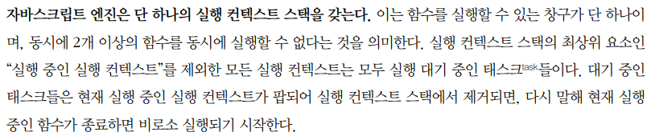
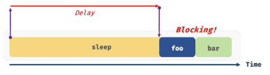
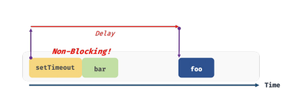

# 비동기와 동기의 차이

## 1. 동기처리(함수)란?

자바스크립트는 실행 컨텍스트 스택이 하나로만 이루어져 있어, 처음이자 메인 실행 컨텍스트인 `window`에서 시작해서 호출되는 순서대로 스택에 쌓인다.

<br>



<br>

```javascript
function sleep(func, delay) {
	const delayUtil = Date.now() + delay;

    while (Date.now() < delayUtil);

    func();

}

function foo() {
console.log('foo');
}

function bar() {
console.log('bar');
}

sleep(foo, 3 \* 1000);
bar();

```

콜백함수로 이루어져 있는 `sleep`함수는 `3 * 1000`만큼의 지연시간을 갖고 콜백함수를
실행시킨다. 이로인해 3초뒤에 bar()함수가 실행되는 지연시간이 된다.
이것을 작업 블로킹(blocking)이라고 하고, 이러한 방식을 동기(sychronous)처리라고한다. 실행순서가 보장된다는 장점이 있지만, 그만큼 블로킹 된다는 단점이 있다.



<br>

## 2. 비동기처리(함수)란?

대표적인 비동기함수에는 setTimeout이 있다.setTimeout은 시간을 지연시킨다는 점에서 sleep()함수와 동일하지만, 비동기방식을 사용하여 bar()함수가 3초가 지나기전에 먼저 실행된다. 즉, 먼저 입력된 테스크가 종료되지 않은 상태라 해도 다음 테스크를 곧바로 실행하는 것이다. 비동기 처리를 수행하는 비동기 함수는 전통적으로 콜백 패턴 사용.

<br>



<br>

|             synchronous             |            asynchronous             |
| :---------------------------------: | :---------------------------------: |
|      실행 컨텍스트 순서 보장 O      |      실행 컨텍스트 순서 보장 X      |
| 순서 보장을 위해 함수 블로킹 발생 O | 순서 보장을 위해 함수 블로킹 발생 X |
